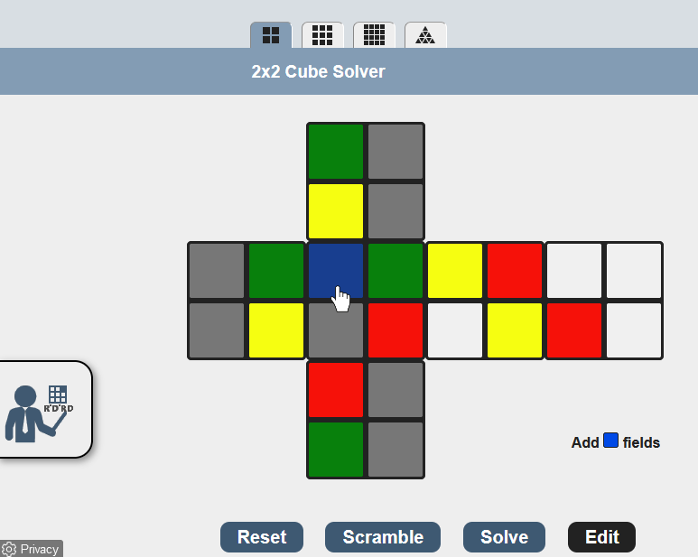

# Rubik Cube Solver
Tugas seleksi Ca-IRK 2019

## Latar Belakang
Kubus rubik merupakan permainan teka-teki mekanik yang sangat populer di seluruh dunia. Seiring berjalannya waktu, variasi rubik semakin banyak mulai dari variasi ukuran 2x2x2 sampai 7x7x7 dan berbagai bentuk geometris seperti seperti tetrahedron /rubik segitiga (Pyraminx) dan rubik segi delapan (Skewb Diamond). Untuk menyelesaikan rubik diperlukan strategi dan langkah-langkah yang berurutan. Semakin baik strategi yang digunakan, semakin sedikit langkah yang kita perlukan untuk menyelesaikan rubik dan semakin singkat pula waktu yang dibutuhkan.

Pada tugas ini, kalian akan membuat program untuk menyelesaikan kubus rubik 3x3x3 dan menampilkan langkah-langkah penyelesaiannya.

## Spesifikasi Wajib (3500 Poin)
1. Program dibuat wajib <b>berbasis web</b>. Namun framework dan bahasa yang digunakan bebas.
2. Program menerima input yang merepresentasikan konfigurasi warna pada kubus rubik, format dibebaskan. Sebagai contoh, input tersebut dapat berupa urutan huruf yang merepresentasikan warna kotak 1x1 pada kubus rubik.
3. Program mencari langkah untuk menyelesaikan kubus rubik 3x3x3. Algoritma yang digunakan bebas namun menjadi salah satu komponen penilaian. 
4. Program menampilkan hasil berupa urutan langkah-langkah pergerakan kubus yang harus dilakukan untuk mencapai konfigurasi akhir kubus beserta visualisasi langkah-langkah dalam kubus rubik tersebut.
  Hint: Terdapat library berbasis javascript yang bisa kalian gunakan untuk melakukan visualisasi kubus rubik

Anda bebas menggunakan pustaka maupun referensi apapun untuk mengerjakan tugas, kecuali kode/pustaka jadi yang menyelesaikan rubik.

## Spesifikasi Bonus (500 Poin)
<i>Note: sebelum mengerjakan bonus, pastikan semua spesifikasi wajib sudah terpenuhi.</i>

User dapat melakukan input customized konfigurasi awal warna rubik yang akan di-solve melalui interaksi antarmuka dengan program. 
Sebagai contoh, interaksi yang dimaksud dapat dilakukan seperti pada gambar berikut.
 
(Selengkapnya bisa kalian coba di: https://rubiks-cube-solver.com/2x2/)

Selain itu, program juga dapat memvalidasi apakah konfigurasi tersebut valid (solvable) atau tidak.

## Komponen Penilaian
1. Kebenaran program dan fungsionalitas
2. Algoritma dan strategi yang dipilih beserta alasanya
3. Kerapihan struktur kode dan repository
4. Tampilan dan interaksi antar muka
5. Kreativitas

## Pengerjaan
1. Buat repository pada github lalu invite <b>annaelvira24</b> dan <b>fadhilrafiii</b> pada repository kalian.
2. Pastikan repository kalian dalam mode <b>Private</b>.
3. Kode program diletakan di dalam folder src dan file input pengujian diletakan di folder test. <b> Minimal terdapat 5 file input pengujian. </b> 
4. Setelah selesai mengerjakan task, silahkan ubah readme sehingga memuat paling tidak informasi sebagai berikut.
* Cara penggunaan program
* Strategi pencarian solusi yang digunakan dan alasan penggunaannya secara lengkap, termasuk kompleksitas algoritmanya
* Referensi, framework, dan library yang membantu Anda dalam mengerjakan tugas ini beserta alasan penggunaannya.
5. Jika sudah selesai, silakan menghubungi kontak berikut untuk penilaian.  
id line: <b>n4_elvira</b> atau <b>padilrf</b>

